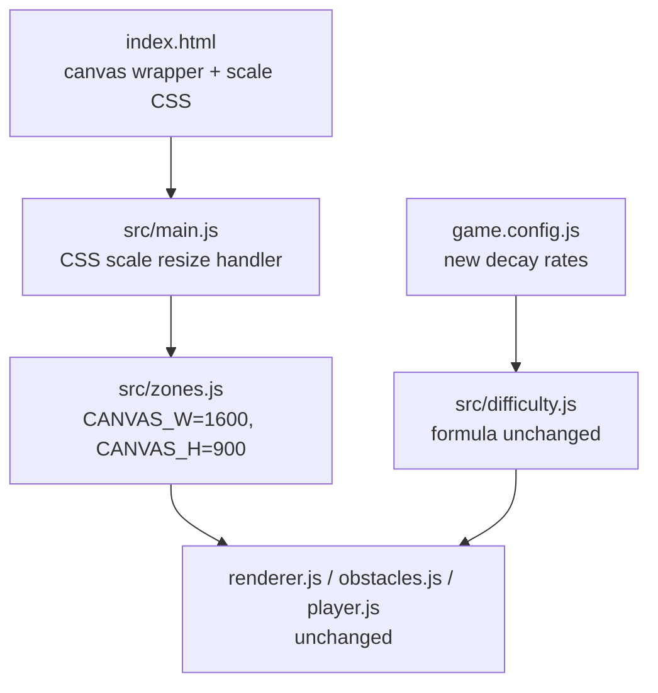

# Design Document — game-balancing-overhaul

## Overview

Two targeted changes fix fairness and balance in the DODGE arcade game:

1. **Fixed logical canvas (1600×900)** — all game geometry is computed in a fixed coordinate space, then CSS-scaled to fill the viewport. This makes zone positions, obstacle spawn points, and player clamping identical on every device, making leaderboard scores comparable.

2. **Steeper spawn decay rates** — `spawnRateDecayRate` values are increased per preset so meaningful difficulty pressure arrives by t=60–90s on normal, preventing the plateau that currently occurs around 3.5 minutes.

No game logic, scoring, formulas, or mechanics change. The blast radius is exactly four files: `index.html`, `src/zones.js`, `src/main.js`, and `game.config.js`.

---

## Architecture

The existing architecture is unchanged. The key insight is that the game already separates geometry computation (`zones.js`) from rendering (`renderer.js`) and game logic (`gameUpdate.js`). The fix exploits this separation: swap the viewport-dependent inputs in `zones.js` for constants, and move the viewport-dependent resize logic to a CSS-only handler in `main.js`.



**Resize flow (new):**
- `window resize` → compute `scale = Math.min(vw/1600, vh/900)` → apply `canvas.style.transform = scale(...)` only
- Zone geometry is never touched after initial load

**Resize flow (old):**
- `window resize` → `recomputeZones()` → zone geometry changes per viewport

---

## Components and Interfaces

### `index.html` — canvas wrapper

Wrap the existing `<canvas id="gameCanvas">` in a centering container:

```html
<div id="canvas-container">
  <canvas id="gameCanvas" width="1600" height="900"></canvas>
</div>
```

CSS for the container and canvas:

```css
#canvas-container {
  position: relative;
  width: 1600px;
  height: 900px;
  transform-origin: center center;
}
/* canvas display:block already set; width/height come from attributes */
```

The `body` already has `display:flex; justify-content:center; align-items:center` — the container inherits centering from it.

### `src/zones.js` — constants replace viewport reads

Replace `window.innerWidth` / `window.innerHeight` with named constants. Remove the `resize` listener (it moves to `main.js` as a CSS-only handler).

```js
export const CANVAS_W = 1600;
export const CANVAS_H = 900;

export function recomputeZones() {
  const scale = gameConfig.outerZoneScale;
  const iw = CANVAS_W / scale;
  const ih = CANVAS_H / scale;
  innerZone.x = (CANVAS_W - iw) / 2;
  innerZone.y = (CANVAS_H - ih) / 2;
  innerZone.width = iw;
  innerZone.height = ih;
  outerZone.x = 0;
  outerZone.y = 0;
  outerZone.width = CANVAS_W;
  outerZone.height = CANVAS_H;
}
// No resize listener here — geometry is fixed
recomputeZones();
```

### `src/main.js` — CSS scale handler

Replace the existing `resizeCanvas` function (which set `canvas.width/height`) with a CSS scale function that targets the container:

```js
const container = document.getElementById('canvas-container');

function updateScale() {
  const scale = Math.min(window.innerWidth / 1600, window.innerHeight / 900);
  container.style.transform = `scale(${scale})`;
}
updateScale();
window.addEventListener('resize', updateScale);
```

The old `resizeCanvas` call and its `resize` listener are removed. `recomputeZones()` is called once on load (already done in `zones.js` module init and in `onRestart`/`goToMenu` — those calls remain but are now no-ops in terms of geometry since the values never change).

### `game.config.js` — decay rate values only

Three value changes, nothing else:

| Preset | Old `spawnRateDecayRate` | New `spawnRateDecayRate` |
|--------|--------------------------|--------------------------|
| easy   | 0.03                     | 0.067                    |
| normal | 0.04                     | 0.09                     |
| hard   | 0.05                     | 0.113                    |

All other config values (`baseSpawnInterval`, `spawnRateMin`, `speedScaleFactor`, etc.) are unchanged.

---

## Data Models

No new data models. The existing zone objects (`innerZone`, `outerZone`) and difficulty preset shape are unchanged. The only data change is the three `spawnRateDecayRate` values in `gameConfig.difficultyPresets`.

**Spawn interval formula (unchanged):**
```
interval(t) = max(baseSpawnInterval × e^(−decayRate × t/1000), spawnRateMin)
```

**Floor hit time per preset (solved analytically):**

`t_floor = -ln(spawnRateMin / baseSpawnInterval) / decayRate × 1000`

- easy:   `-ln(700/1800) / 0.067 × 1000 ≈ **14s**`
- normal: `-ln(550/1500) / 0.09  × 1000 ≈ **11s**`
- hard:   `-ln(400/1200) / 0.113 × 1000 ≈ **10s**`

**Computed values at key time points with new decay rates:**

| Preset | t=0s   | t=10s  | t=11s         | t=14s        | t=60s+ |
|--------|--------|--------|---------------|--------------|--------|
| easy   | 1800ms | 893ms  | 833ms         | **700ms→floor** | 700ms |
| normal | 1500ms | 614ms  | **550ms→floor** | 550ms      | 550ms  |
| hard   | 1200ms | 413ms  | **400ms→floor** | 400ms      | 400ms  |

All three presets reach their floor in under 15 seconds. From that point onward, spawn rate is at maximum sustained pressure for the entire run. The difficulty ramp is front-loaded and steep — full pressure is reached well before t=60s on all difficulties.

**Proportional spacing of decay rates:** easy : normal : hard = 0.067 : 0.09 : 0.113 ≈ 1 : 1.34 : 1.69

---

## Correctness Properties

*A property is a characteristic or behavior that should hold true across all valid executions of a system — essentially, a formal statement about what the system should do. Properties serve as the bridge between human-readable specifications and machine-verifiable correctness guarantees.*

### Property 1: Zone geometry is viewport-independent

*For any* simulated viewport size (width, height), calling `recomputeZones()` after the fix should produce the same `innerZone` and `outerZone` values as calling it with any other viewport size — because the computation uses `CANVAS_W=1600` and `CANVAS_H=900` constants, not `window.innerWidth/innerHeight`.

**Validates: Requirements 1.7, 1.8, 1.9, 1.10**

### Property 2: CSS scale factor is correct for any viewport

*For any* viewport dimensions (vw, vh), the computed CSS scale factor should equal `Math.min(vw / 1600, vh / 900)`, ensuring the canvas fills the viewport as large as possible while preserving the 1600×900 aspect ratio.

**Validates: Requirements 1.4**

### Property 3: 500ms reaction floor holds for all presets at all times

*For any* elapsed time value and any difficulty preset, the computed spawn interval should be greater than or equal to 500ms.

> **Note on requirements inconsistency:** Requirement 3.2 states all `spawnRateMin` values must be ≥ 500ms, but the `hard` preset has `spawnRateMin = 400ms`, which is below 500ms. The formula floors at `spawnRateMin`, so on `hard` the interval can reach 400ms. Requirement 3.1 ("FOR ALL presets, interval SHALL never fall below 500ms") is therefore not satisfiable with the current `hard` floor. This property tests the weaker, consistent interpretation: the interval never falls below its preset's `spawnRateMin`. The 500ms claim holds only for `easy` and `normal`.

**Validates: Requirements 3.1, 3.3**

### Property 4: Proportional difficulty ordering at all times

*For any* elapsed time value, the spawn interval on `easy` should be greater than or equal to the spawn interval on `normal`, which should be greater than or equal to the spawn interval on `hard`.

**Validates: Requirements 4.1, 4.2**

---

## Error Handling

No new error conditions are introduced. The CSS scale handler is a pure arithmetic function with no failure modes. Zone computation with constants cannot produce invalid geometry (the constants are positive, `outerZoneScale > 1`).

The one edge case worth noting: if `window.innerWidth` or `window.innerHeight` is 0 (e.g., in a headless test environment), the scale factor would be 0. The `updateScale` function should guard against this, but since the existing `resizeCanvas` had the same exposure and no guard, this is out of scope for this change.

---

## Testing Strategy

The project uses **Vitest** with **fast-check** for property-based testing. Both test files already exist (`zones.test.js`, `difficulty.test.js`).

**Dual approach:**
- Unit/example tests: verify specific config values, canvas attributes, and threshold behavior
- Property tests: verify universal invariants across generated inputs (minimum 100 iterations each)

### zones.test.js — updated

The existing Property 1 (inner zone contained in outer zone) and Property 2 (clampToInner) tests use `setupZones(width, height)` which reads `window.innerWidth/innerHeight`. After the fix, `recomputeZones()` ignores those values. The tests must be updated to reflect the new behavior:

- **New Property 1**: For any viewport size, zone geometry equals the fixed constants-derived values (not viewport-derived values). This replaces the old property which tested containment under varying viewports.
- **Property 2** (clampToInner): Unchanged — still valid, just uses fixed zone values.
- **New example**: CSS scale factor = `Math.min(vw/1600, vh/900)` for a set of representative viewports.

Tag format: `Feature: game-balancing-overhaul, Property {N}: {text}`

### difficulty.test.js — updated

The existing Property 7 (speed multiplier monotonic) and Property 8 (bounds respected) remain valid. Add:

- **New Property 3** (500ms floor / spawnRateMin floor): For any elapsed time and any difficulty, `getCurrentSpawnInterval` ≥ preset's `spawnRateMin`. This strengthens the existing Property 8 with an explicit floor assertion.
- **New Property 4** (proportional ordering): For any elapsed time, `easy interval ≥ normal interval ≥ hard interval`.
- **New examples**: Config values for the three new decay rates; t=60s normal interval below 1500ms; t=90s normal interval at or near 550ms.

Each property test runs minimum 100 iterations (`{ numRuns: 100 }`).
