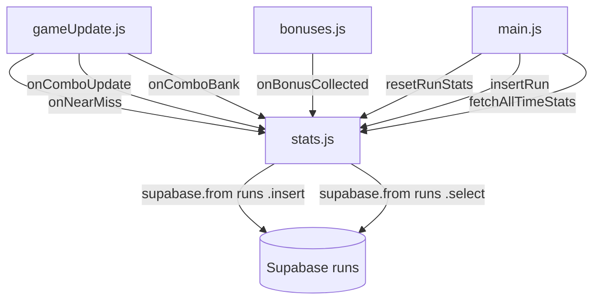

# Design Document: player-stats

## Overview

The player-stats feature adds a two-layer statistics system to DODGE. A new `src/stats.js` module tracks four in-run counters (near-misses, bonuses collected, max combo, combo score), inserts a run record into Supabase on death for authenticated players, and exposes a `fetchAllTimeStats()` function for aggregate queries.

The UI has two surfaces: a collapsible per-run panel appended to the existing `#game-over-screen` overlay (visible to all players), and an all-time stats overlay accessible from the main menu (authenticated players only). Both follow the existing `.overlay` / `.open` pattern exactly.

No new files are created beyond `src/stats.js`. All HTML and CSS go into `index.html` following the established overlay pattern.

---

## Architecture

```
main.js
  ├── imports stats.js
  ├── calls resetRunStats() on restart
  ├── calls insertRun(state) on death (inside showGameOver timeout)
  └── wires Stats button visibility on auth state change

gameUpdate.js
  └── calls onComboBank(amount) when pendingScore banks (alongside triggerScoreFloat)

collision.js (via gameUpdate.js)
  └── onNearMiss callback already passed to checkNearMisses — stats.onNearMiss added here

bonuses.js
  └── calls onBonusCollected() inside collectBonus()

gameUpdate.js
  └── calls onComboUpdate(state.comboMultiplier) each frame when multiplier > 1
```



**Key decisions:**

- `stats.js` holds module-level counter variables (not on `state`) — counters are ephemeral per-run, not part of the serializable game state.
- `onComboUpdate` is called every frame from `gameUpdate.js` when `comboMultiplier > 1.0` — cheap comparison, no extra event needed.
- `onComboBank` is called at the same site as `triggerScoreFloat` in `gameUpdate.js` — both fire on the same bank event.
- Auth check inside `insertRun` is async (`supabase.auth.getUser()`), fire-and-forget — `main.js` does not await it.
- The Stats button visibility is driven by `supabase.auth.onAuthStateChange` listener wired in `main.js`.

---

## Components and Interfaces

### `src/stats.js`

Module-level state (not exported):
```js
let nearMisses = 0;
let bonusesCollected = 0;
let maxCombo = 1.0;
let comboScore = 0;
```

Exported interface:
```js
// Resets all four counters — call on every restart
export function resetRunStats()

// Increments nearMisses by 1
export function onNearMiss()

// Increments bonusesCollected by 1
export function onBonusCollected()

// Updates maxCombo if multiplier exceeds current value
export function onComboUpdate(multiplier)

// Adds amount to comboScore
export function onComboBank(amount)

// Checks auth, inserts run record if authenticated, fire-and-forget
export async function insertRun(state)

// Queries runs table, returns aggregate stats object for current user
export async function fetchAllTimeStats()
```

`insertRun(state)` payload:
```js
{
  score: Math.round(state.score),
  elapsed_ms: Math.round(state.elapsed),
  difficulty: state.difficulty,
  near_misses: nearMisses,
  max_combo: maxCombo,
  combo_score: Math.round(comboScore),
  bonuses_collected: bonusesCollected,
  played_at: new Date().toISOString()
}
```

`fetchAllTimeStats()` return shape:
```js
{
  totalRuns: number,
  bestScoreEasy: number,
  bestScoreNormal: number,
  bestScoreHard: number,
  totalNearMisses: number,
  totalBonuses: number,
  highestCombo: number,
  bestComboScore: number,
  totalElapsedMs: number,
  avgScore: number,
  avgElapsedMs: number
}
```

### Hook points in existing files

| File | Change |
|------|--------|
| `gameUpdate.js` | Add `onNearMiss` to the `checkNearMisses` callback; call `onComboUpdate(state.comboMultiplier)` and `onComboBank(banked)` at the bank site |
| `bonuses.js` | Call `onBonusCollected()` inside `collectBonus()` |
| `main.js` | Import stats functions; call `resetRunStats()` in `onRestart()`; call `insertRun(state)` inside the death timeout; wire Stats button; wire `supabase.auth.onAuthStateChange` |

### HTML additions to `index.html`

**Per-run panel** — appended inside `#game-over-screen .overlay-panel`:
```html
<div id="run-stats-toggle" class="overlay-label" style="cursor:pointer;margin-top:8px">▶ Run Stats</div>
<div id="run-stats-panel" style="display:none;...">
  <!-- stat rows -->
</div>
```

**All-time overlay** — new `.overlay` div alongside existing overlays:
```html
<div id="stats-screen" class="overlay">
  <div class="overlay-panel">...</div>
</div>
```

**Stats button** — inside `#difficulty-screen .overlay-panel`, hidden by default:
```html
<button id="stats-btn" class="overlay-btn" style="display:none;background:#222">Stats</button>
```

---

## Data Models

### `runs` table (existing, already has `combo_score` column)

| Column | Type | Notes |
|--------|------|-------|
| `id` | bigint | auto |
| `user_id` | uuid | references profiles.id |
| `score` | numeric | rounded integer |
| `elapsed_ms` | integer | ms survived |
| `difficulty` | text | 'easy' \| 'normal' \| 'hard' |
| `near_misses` | integer | from stats.js counter |
| `max_combo` | numeric | peak multiplier |
| `combo_score` | numeric | sum of banked pending score |
| `bonuses_collected` | integer | from stats.js counter |
| `played_at` | timestamptz | ISO string at run end |

### Aggregate query

`fetchAllTimeStats()` performs a single `select('*')` on `runs` filtered by `user_id` (via RLS — no explicit filter needed), then computes aggregates client-side. Row count is expected to be small (hundreds at most for a free-tier game), so client-side aggregation is acceptable and avoids a custom RPC.

---

## Correctness Properties

*A property is a characteristic or behavior that should hold true across all valid executions of a system — essentially, a formal statement about what the system should do. Properties serve as the bridge between human-readable specifications and machine-verifiable correctness guarantees.*

### Property 1: nearMisses increments by exactly 1

*For any* initial nearMisses value, calling `onNearMiss()` once should increase the counter by exactly 1.

**Validates: Requirements 1.2**

### Property 2: bonusesCollected increments by exactly 1

*For any* initial bonusesCollected value, calling `onBonusCollected()` once should increase the counter by exactly 1.

**Validates: Requirements 1.3**

### Property 3: maxCombo tracks the running maximum

*For any* sequence of `onComboUpdate(multiplier)` calls, `maxCombo` should equal the maximum value ever passed in that sequence.

**Validates: Requirements 1.4**

### Property 4: comboScore accumulates the sum

*For any* sequence of `onComboBank(amount)` calls, `comboScore` should equal the sum of all amounts passed.

**Validates: Requirements 1.5**

### Property 5: resetRunStats zeroes all counters

*For any* prior counter state, calling `resetRunStats()` should set nearMisses, bonusesCollected, maxCombo (to 1.0), and comboScore all to their initial values.

**Validates: Requirements 1.6**

### Property 6: Stats button visibility matches auth state

*For any* auth state change (login or logout), the Stats button's visibility should equal whether the user is authenticated — shown for authenticated players, hidden for guests.

**Validates: Requirements 4.7, 5.1, 5.2, 5.3**

### Property 7: Per-run panel toggle is a round-trip

*For any* panel state (collapsed or expanded), clicking the toggle twice should return the panel to its original state.

**Validates: Requirements 3.3, 3.4**

---

## Error Handling

- `insertRun`: wraps the Supabase insert in a try/catch (or `.catch(() => {})`). No retry, no user notification. One lost run is acceptable per the architecture decision.
- `fetchAllTimeStats`: throws on failure — the caller (`main.js`) catches it and shows an error message in the overlay.
- Auth check in `insertRun`: if `getUser()` returns no user or throws, the insert is skipped silently.
- No error handling is added to the counter functions — they are pure synchronous increments with no failure modes.

---

## Testing Strategy

**Dual approach**: unit tests for specific examples and edge cases; property-based tests for universal counter invariants.

**Unit tests** (`src/stats.test.js`):
- `insertRun` with mocked authenticated user → verify supabase insert called with correct payload shape
- `insertRun` with mocked guest (null user) → verify insert never called
- `insertRun` when insert rejects → verify no throw (fire-and-forget)
- `fetchAllTimeStats` with mocked rows → verify aggregate computation
- `fetchAllTimeStats` when fetch throws → verify error propagates
- Per-run panel: collapsed by default on game-over open
- Per-run panel: toggle shows/hides panel
- Stats button: hidden when guest, shown when authenticated
- All-time overlay: opens on Stats button click, closes on Escape, closes on backdrop click
- All-time overlay: shows "no stats" message when rows empty
- All-time overlay: shows error message when fetch fails

**Property-based tests** (`src/stats.test.js`, using `fast-check`):
- Property 1: nearMisses increment — `fc.integer()` as initial offset via repeated calls, verify +1 each time
  Tag: `Feature: player-stats, Property 1: nearMisses increments by exactly 1`
- Property 2: bonusesCollected increment — same pattern
  Tag: `Feature: player-stats, Property 2: bonusesCollected increments by exactly 1`
- Property 3: maxCombo running maximum — `fc.array(fc.float({ min: 1.0, max: 5.0 }), { minLength: 1 })`, verify result equals `Math.max(...arr)`
  Tag: `Feature: player-stats, Property 3: maxCombo tracks the running maximum`
- Property 4: comboScore sum — `fc.array(fc.float({ min: 0, max: 1000 }), { minLength: 1 })`, verify result equals sum
  Tag: `Feature: player-stats, Property 4: comboScore accumulates the sum`
- Property 5: reset zeroes all — arbitrary sequence of calls then reset, verify all counters at initial values
  Tag: `Feature: player-stats, Property 5: resetRunStats zeroes all counters`
- Property 6: stats button visibility — `fc.boolean()` for isAuthenticated, verify button display matches
  Tag: `Feature: player-stats, Property 6: Stats button visibility matches auth state`
- Property 7: toggle round-trip — arbitrary initial panel state, toggle twice, verify same state
  Tag: `Feature: player-stats, Property 7: Per-run panel toggle is a round-trip`

Each property test runs minimum 100 iterations. `fast-check` is already available via CDN for test files (vitest environment).
