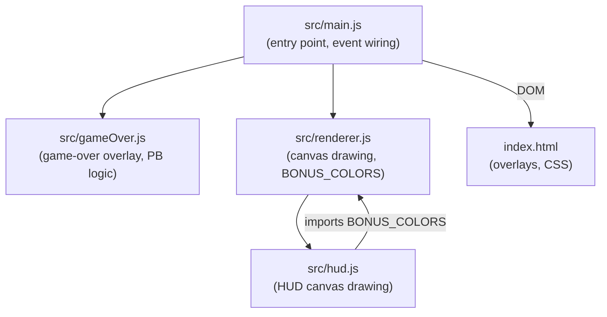

# Design Document: UI Consistency Overhaul

## Overview

This overhaul addresses accumulated code quality debt across five in-scope files: `index.html`, `src/main.js`, `src/gameOver.js`, `src/renderer.js`, and `src/hud.js`. No game logic, canvas rendering behavior, or visual palette changes. The work falls into three categories:

1. **JS cleanup** — consolidate keydown listeners, fix a listener leak in `gameOver.js`, extract a helper for modal guard logic, remove dead code, deduplicate a constant.
2. **CSS/HTML cleanup** — move repeated inline styles to named classes, fix z-index scale, adopt `.open` class pattern for `run-stats-panel`.
3. **Visual polish** — consistent button borders, hover states, panel backgrounds.

All changes are structural. The neon palette (`#00eeff`, `#00ff88`, `#ff4444`, `#ffe600`, `#cc44ff`) is preserved throughout.

---

## Architecture

The game uses a canvas/HTML split: the `<canvas>` renders the game world; all menus and overlays are HTML `div` elements toggled via the `.open` CSS class pattern (`display:none` → `display:flex`). `src/main.js` is the entry point and wires all modules together.



**Key invariant**: overlays are shown/hidden exclusively via `.open` class toggling. No module sets `style.display` on overlay elements directly, except `#help-btn` which is controlled only through `syncHelpBtn()`.

---

## Components and Interfaces

### 1. KeydownRegistry (`src/main.js`)

Replaces five separate `window.addEventListener('keydown', ...)` calls with a single consolidated handler.

**Priority order** (top = highest priority, first match wins):

| Priority | Condition | Action |
|---|---|---|
| 1 | `#how-to-play` is open | Close how-to-play, return |
| 2 | `#leaderboard-screen` is open | Close leaderboard, return |
| 3 | `#stats-screen` is open | Close stats, return |
| 4 | `#config-panel` is visible | Guard — return (config panel handles its own keys) |
| 5 | `status === 'dead'` or `status === 'start'` | Guard — return |
| 6 | `key === 'Escape'` | Pause or unpause |
| 7 | `key === 'r'/'R'` and `#game-over-screen` is open | Restart |

The existing `onStartAction` keydown listener remains separate — it is added/removed dynamically and handles the "any key starts the game" behavior from the difficulty screen.

### 2. isAnyModalOpen (`src/main.js`)

```js
function isAnyModalOpen() {
  return ['#how-to-play', '#leaderboard-screen', '#stats-screen']
    .some(id => document.querySelector(id).classList.contains('open'));
}
```

Used in `onStartAction` to replace the three individual `classList.contains('open')` checks. Adding a new blocking overlay requires updating only this function.

### 3. gameOver.js cleanup

Module-level variables hold the active listeners so `cleanup()` can remove them:

```js
let _onClickRestart = null;
let _onKey = null;

export function showGameOver(state, onRestart) {
  // ... populate overlay ...
  _onClickRestart = () => { cleanup(); onRestart(); };
  _onKey = (e) => { if (e.key === 'r' || e.key === 'R') { cleanup(); onRestart(); } };
  document.getElementById('restart-btn').addEventListener('click', _onClickRestart);
  window.addEventListener('keydown', _onKey);
}

export function cleanup() {
  if (_onClickRestart) {
    document.getElementById('restart-btn').removeEventListener('click', _onClickRestart);
    _onClickRestart = null;
  }
  if (_onKey) {
    window.removeEventListener('keydown', _onKey);
    _onKey = null;
  }
}
```

`goToMenu()` in `main.js` calls `cleanup()` before resetting state. `onRestart` calls `cleanup()` internally (already the case — preserved).

### 4. syncHelpBtn

No logic change. The function remains:

```js
function syncHelpBtn() {
  helpBtn.style.display = (state.status === 'start' || state.status === 'paused') ? 'block' : 'none';
}
```

It is the **only** place that sets `helpBtn.style.display`. All six existing call sites (start, pause, resume, restart, go-to-menu, death) are preserved. No new direct `style.display` assignments are introduced.

### 5. run-stats-panel `.open` class pattern

CSS:
```css
#run-stats-panel { display: none; }
#run-stats-panel.open { display: block; }
```

JS toggle (replaces `panel.style.display` assignments):
```js
panel.classList.toggle('open');
toggle.textContent = panel.classList.contains('open') ? '▼ Run Stats' : '▶ Run Stats';
```

On new game-over open, collapse via `panel.classList.remove('open')` instead of `panel.style.display = 'none'`.

### 6. renderStartScreen removal

Delete `renderStartScreen` from `renderer.js`. Remove from the named import in `main.js`. Update `renderFrame`:

```js
// Before
if (state.status === 'start') { render(ctx, state, lastDelta); renderStartScreen(ctx); return; }

// After
if (state.status === 'start') { render(ctx, state, lastDelta); return; }
```

The function drew a fully transparent rectangle (`rgba(0,0,0,0.0)`) — a no-op. The HTML overlay handles all start-screen UI; the canvas renders the star field via the normal `render()` call unchanged.

### 7. BONUS_COLORS deduplication

In `renderer.js`, add `export` to the existing const:
```js
export const BONUS_COLORS = { ... };
```

In `hud.js`, replace the local `const BONUS_COLORS` with an import:
```js
import { BONUS_COLORS } from './renderer.js';
```

No value changes — same four entries, same hex strings.

### 8. CSS classes extracted from inline styles

| Class | Replaces | Applied to |
|---|---|---|
| `.screen-title` | `overlay-title` + per-screen color/shadow inline styles | DODGE, PAUSED, GAME OVER titles |
| `.overlay-secondary-btn` | `style="background:#222"` | Menu, Leaderboard, Stats, Go-to-menu buttons |
| `.menu-btn-stack` | `style="display:flex;flex-direction:column;..."` on overlay-panel children | Full-width stacked button groups |
| `.diff-btn-row` | `style="display:flex;gap:8px;..."` on difficulty button container | Difficulty button row |
| `.auth-link` | `style="cursor:pointer;background:none;border:none;color:#888;font:12px monospace;..."` | `#auth-btn` |

Inline styles are retained only for values unique to a single element (e.g. per-screen title color: `#00eeff`, `#fff`, `#ff4444`).

---

## Data Models

No new data structures. Existing state shape in `GameState.js` is unchanged. The only data-adjacent change is the `_onClickRestart` / `_onKey` module-level variables in `gameOver.js` (replacing the closure-local variables that were inaccessible to `cleanup()`).

---

## Correctness Properties

*A property is a characteristic or behavior that should hold true across all valid executions of a system — essentially, a formal statement about what the system should do. Properties serve as the bridge between human-readable specifications and machine-verifiable correctness guarantees.*

### Property 1: isAnyModalOpen reflects all overlay states

*For any* combination of open/closed states across `#how-to-play`, `#leaderboard-screen`, and `#stats-screen`, `isAnyModalOpen()` SHALL return `true` if and only if at least one of those elements has the `open` class.

**Validates: Requirements 2.1, 2.3**

---

### Property 2: cleanup() removes all listeners and is safe to call repeatedly

*For any* call to `showGameOver`, after `cleanup()` is called, neither the restart button click nor an R keydown event SHALL trigger the `onRestart` callback. Additionally, calling `cleanup()` a second time (or before `showGameOver` has been called) SHALL not throw an error.

**Validates: Requirements 3.1, 3.3, 3.4**

---

### Property 3: run-stats-panel toggle uses .open class exclusively

*For any* sequence of toggle button clicks, the panel's visibility SHALL be controlled solely by the presence or absence of the `open` class — `panel.style.display` SHALL remain empty string (unset) throughout.

**Validates: Requirements 5.1, 5.2, 5.3**

---

### Property 4: BONUS_COLORS identity across modules

*For any* bonus type key, the color value accessed via the `BONUS_COLORS` import in `hud.js` SHALL be strictly equal to the value exported from `renderer.js` — they reference the same object.

**Validates: Requirements 7.4**

---

### Property 5: Key guard conditions preserved

*For any* keydown event with key `'Escape'` when `state.status` is `'dead'` or `'start'`, the pause/unpause logic SHALL NOT execute. *For any* keydown event with key `'r'` or `'R'` when `#game-over-screen` does not have the `open` class, the restart logic SHALL NOT execute.

**Validates: Requirements 1.4**

---

### Property 6: z-index ordering is correct across all overlays

*For any* rendered state, the computed z-index values SHALL satisfy: `#difficulty-screen (10)` < `.overlay base (20)` < `#help-btn (25)` < `#how-to-play (30)`.

**Validates: Requirements 9.2, 9.3, 9.4**

---

### Property 7: render() is called for start status

*For any* call to `renderFrame()` when `state.status === 'start'`, the `render(ctx, state, lastDelta)` function SHALL be called exactly once and `renderStartScreen` SHALL NOT be called.

**Validates: Requirements 6.3, 6.4**

---

### Property 8: Panel backgrounds use consistent color

*For any* overlay panel element (`.htp-panel`, `#run-stats-panel`), the computed background color SHALL equal `#0d0d1a`.

**Validates: Requirements 10.6**

---

## Error Handling

- `cleanup()` in `gameOver.js` guards with null checks before calling `removeEventListener` — no throw on double-call.
- `isAnyModalOpen()` uses `document.querySelector` which returns `null` for missing elements; the implementation should use the known-present IDs directly (no null guard needed since these elements are static in `index.html`).
- No new async paths introduced. No new error states.

---

## Testing Strategy

**Dual approach**: unit tests for specific examples and edge cases; property-based tests for universal behavioral properties.

**Unit tests** (specific examples, integration points, edge cases):
- `isAnyModalOpen()` with each overlay open individually and all closed
- `cleanup()` called before `showGameOver` — no throw
- `cleanup()` called twice after `showGameOver` — no throw, no double-remove
- `renderFrame()` with `status === 'start'` calls `render()` and not `renderStartScreen`
- `run-stats-panel` toggle: first click adds `.open`, second click removes `.open`
- `run-stats-panel` on game-over open: `.open` is absent regardless of prior state
- z-index values: `#difficulty-screen` < `.overlay` < `#help-btn` < `#how-to-play`

**Property-based tests** (universal properties, minimum 100 iterations each):

Each property test must reference its design document property using the tag format:
`// Feature: ui-consistency-overhaul, Property {N}: {property_text}`

Use [fast-check](https://github.com/dubzzz/fast-check) (already available in the JS ecosystem, consistent with the existing Vitest setup).

| Property | Test description |
|---|---|
| P1 | Generate random boolean triples for overlay open states; assert `isAnyModalOpen()` === logical OR of the three |
| P2 | For any `onRestart` callback, after `cleanup()`, R key and button click do not invoke it |
| P3 | For any sequence of N toggle clicks, `panel.classList.contains('open')` === (N % 2 === 1), `style.display` always `''` |
| P4 | `BONUS_COLORS` imported in `hud.js` === `BONUS_COLORS` exported from `renderer.js` (reference equality) |
| P5 | For any `state.status` in `['dead', 'start']`, Escape keydown does not change status |
| P6 | Computed z-index ordering holds: difficulty(10) < overlay(20) < help-btn(25) < how-to-play(30) |
| P7 | For any `lastDelta`, `renderFrame` with `status === 'start'` calls `render` once, never `renderStartScreen` |
| P8 | All `.htp-panel` and `#run-stats-panel` elements have background `#0d0d1a` |

**Unit testing balance**: property tests handle broad input coverage; unit tests focus on the specific edge cases (double-cleanup, pre-showGameOver cleanup, exact z-index values). Avoid duplicating coverage between the two.
